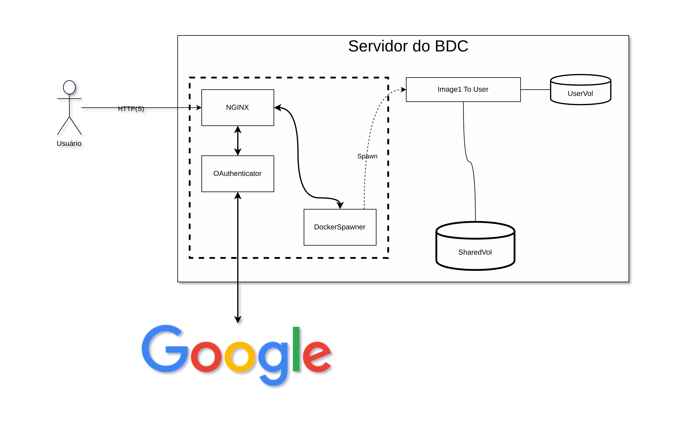

# jupyterhub-bdc

This repository aims to present an example of using dockerhub with dockerspawner

## Run

Insert your google credentials in the [.env file](.env) and run

```shell
./build.sh
```

## Architecture

This example has the following architecture


